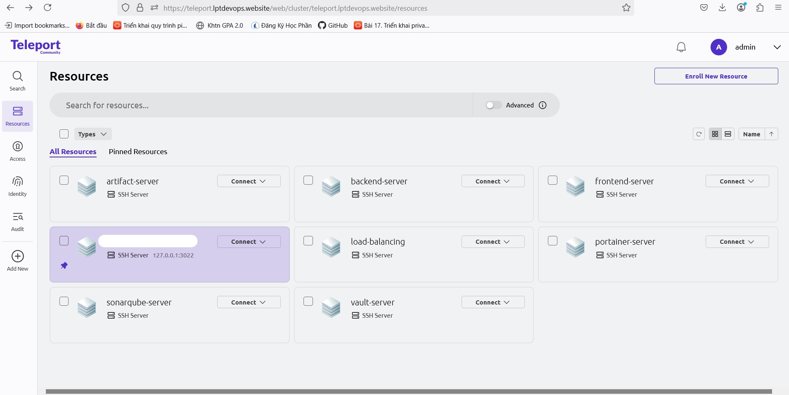

# GitHub Action CI/CD with 3-Tier App

## Overview
This project implements a complete CI/CD pipeline using GitHub Actions for a 3-tier application. The infrastructure is provisioned on Google Cloud Platform (GCP) using Terraform and Ansible, ensuring automation and security in the deployment process.

## Technologies Used
- **CI/CD**: GitHub Actions, SonarQube, Trivi
- **Cloud Infrastructure**: GCP (VM, VPC)
- **Containerization & Orchestration**: Docker, Harbor, Portainer
- **Security & Access Control**: HashiCorp Vault, Teleport
- **Automation & Configuration Management**: Terraform, Ansible
- **Artifact Management**: JFrog Artifactory

## Infrastructure as Code (IaC) Tools
- **Portainer**: 
  
- **HashiCorp Vault**: Manages secrets and sensitive credentials securely for infrastructure and application access.
  
- **Teleport**: Provides secure SSH access and authentication for infrastructure resources.
  
- **Harbor**: Private container registry for storing and managing Docker images securely.
  
- **JFrog Artifactory**: Centralized repository for storing security scan reports and build artifacts.
  

## Features
- Automated infrastructure provisioning on GCP using Terraform and Ansible
- Secure SSH access via Teleport
- Secrets management using HashiCorp Vault
- CI/CD pipelines for automated builds, security scanning, and deployments
- Source code analysis with SonarQube and Trivi
- Private Docker image registry using Harbor
- Security scan report storage on JFrog Artifactory

## GitHub Repository
- **Frontend**: [shoeshop_fe](https://github.com/DevopsLPT/shoeshop_fe)
- **Backend**: [shoeshop_be](https://github.com/DevopsLPT/shoeshop_be)
